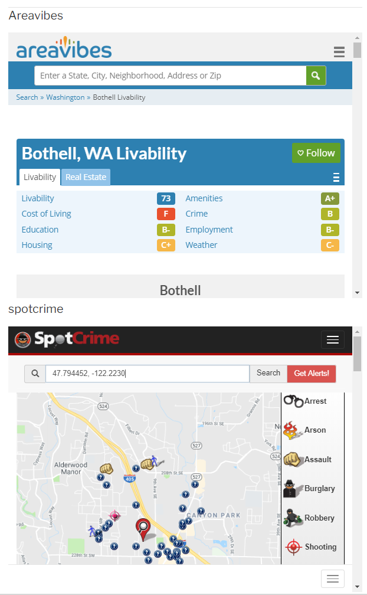

# RedfinPlus
[redfin.com][rf-url] is a fantastic source of information on housing. Their [redfin-datacenter][rf-dc] is another great data source on trends and market research. I've used their website, and their agents to purchase my first house. 

This [RedfinPlus][rf+url] is a [Python 2.7][py-url] wrapper for [redfin.com][rf-url] apis. It helps run daily searches to find new houses, and apply your own score function to filter and sort search results. It also has a [tampermonkey][rf+tm] web page enhancer that adds score funtion results and some missing information from ([AreaVibes][av-url] and [SpotCrime][sc-url]).



more details on the Redfin REST API is in the [docs](./docs/README.md) folder

# Development
install a virtual envirnoment and load the requirements with the following commands
```
pip install --upgrade virtualenv
virtualenv .venv
pip install -r src\requirments.txt
```

you may run the tests with 
```
python src\HouseScore_tests.py
```

[rf+url]:https://github.com/AlienTechSoftware/RedfinPlus
[rf-url]:http://www.redfin.com
[rf-dc]:https://www.redfin.com/blog/data-center
[rf+tm]:https://greasyfork.org/en/scripts/371945-redfinplus
[av-url]:https://www.areavibes.com
[sc-url]:https://spotcrime.com
[py-url]:http:python.org
